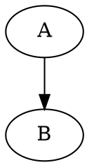

# Presentation Template

This is my presentation template using pandoc to translate a markdown file called `slides.md` to HTML. The presentation
is styled using CSS contained in the `slides.css` file. The `make` command is used to easily create a self-contained
HTML presentation, which means a single HTML file is enough to start the presentation from any machine.

## Prerequisites

- [pandoc](https://pandoc.org/installing.html) has to be installed and be available in the `PATH`
- The [`make`](https://www.gnu.org/software/make/) command has to be available in the `PATH`
- The [`dot`](https://www.graphviz.org/download/) command has to be available in the `PATH` as well if diagrams should
be generated

## Create the presentation

Building the presentation into a single self-contained HTML file is done by executing the following command:

```bash
make html
```

## Customizing the presentation

This is just a project template, so it only contains boilerplate code, that can be changed as required. The following
sections explain each file in detail.

### slides.md

This file is written using [pandoc's flavour of markdown](https://pandoc.org/MANUAL.html#pandocs-markdown). The first
lines are information for the title slide of the presentation:


```markdown
% Title of the presentation
% Author of the presentation
% Date of the presentation
```

Afterwards the other slides are defined. Every first and second level header will be its own slide.

```markdown
# Slide 1

## Slide 2

### Content on Slide 2
```

Additionally `graphviz` code can be directly embeded as SVGs in the presentation by using a fenced code block with the
`graphviz` annotation:

~~~markdown

~~~

### slides.css

This file contains the CSS that will be inlined in the built presentation. It relies on the HTML structure pandoc is
generating.

### slides_before_body.html

Contains a few lines of JavaScript to change slides when the left or right arrow key is pressed.

### codeblock-filter.lua

This lua script will generate the SVG graphics from `graphviz` code blocks in `slides.md`.
